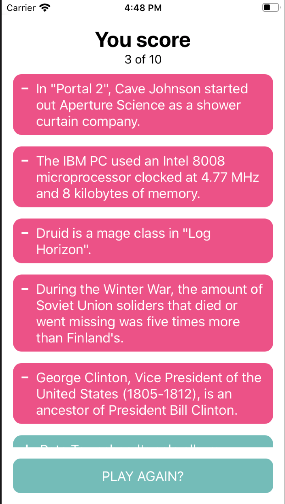

# Trivia Challenge App

An animated trivia challenge application for IOS and Android written in React Native.

## Installation

```bash
$ yarn install
```

## Running the app

```bash
# iOS devices
$ yarn ios

# Android devices
$ yarn android
```

## Test

```bash
# run unit tests
$ yarn test

# run linter
$ yarn lint

# run prettier
$ yarn prettier:write
```

## Example

</img>
</img>
</img>
</img>


## Stay in touch

- Author - [Daniel Mejia](https://github.com/danielmejiadev)