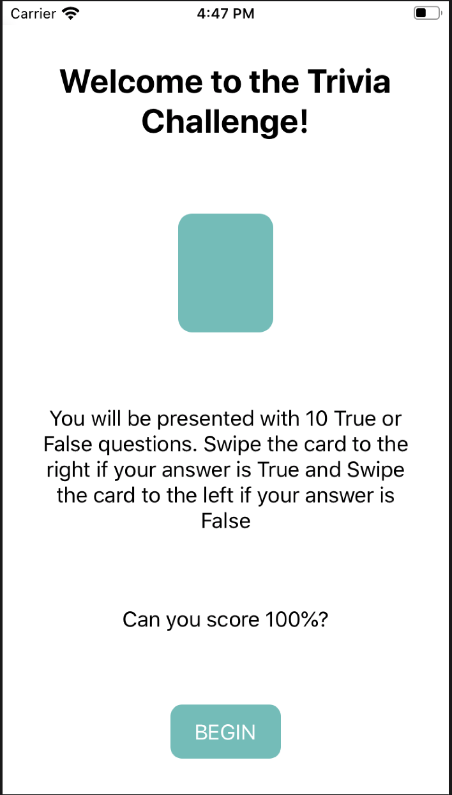
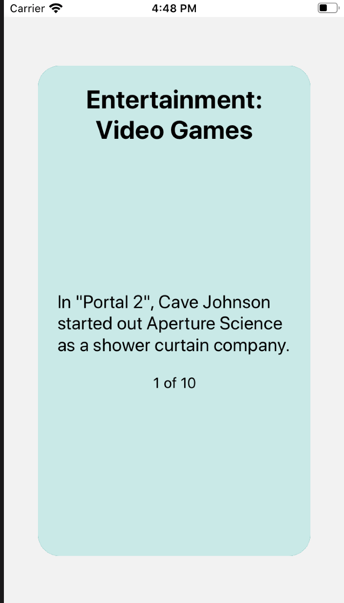
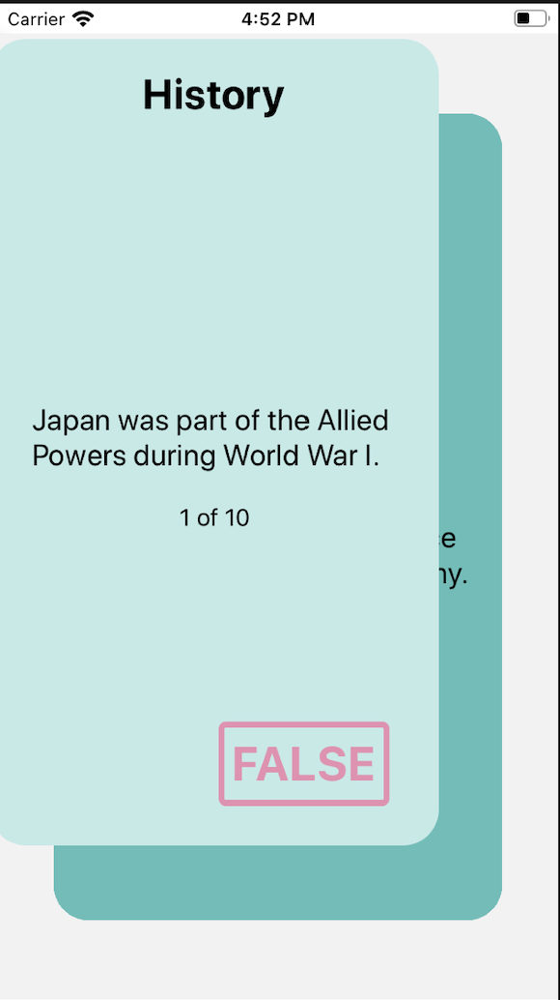

# Trivia Challenge App

An animated trivia challenge application for IOS and Android written in React Native.

## Installation

```bash
$ yarn install
```

## Running the app

```bash
# iOS devices
$ yarn ios

# Android devices
$ yarn android
```

## Test

```bash
# run unit tests
$ yarn test

# run linter
$ yarn lint

# run prettier
$ yarn prettier:write
```
## Technologies used in the project

### Basic
- Expo
- React Native
- React
- React Hooks API
- React Context API
- React Navigation 5
- Typescript

### Animations
- React Native Reanimated
- React Native Gesture Handler
- React Native Redash

### Styling and Theming 
- Styled components

### Testing
- Jest
- Testing library react hooks
- Enzyme

### Code quality
- Eslint
- Prettier
- Github actions CICD


## Project structure

- apiClient
  - Client http to execute API requests
- components
  - Reusable components
- hooks
  - Custom hooks
- interfaces
  - Application types
- navigation
  - Navigation definition
- screens
  - Main screens in the app
- store
  - Definition of stores
- theme.ts

## Example

</img>
</img>
</img>


## Stay in touch

- [Repository](https://github.com/danielmejiadev/trivia-game)
- Author - [Daniel Mejia](https://github.com/danielmejiadev)